# 初步认识数据库

## 数据库

Table描述了一批相互有关联关系的数据，也叫**关系**

* 表/关系
  * （关系）模式
    * 表名
    * 表标题（格式）
  * 表内容（值）
* 列/字段/属性/数据项
* 行/元组/记录

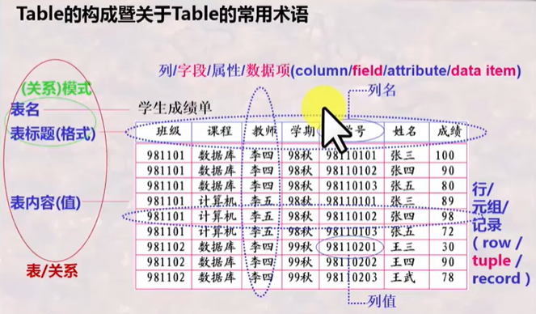

Database：相互之间有关联关系的Table的集合

## 数据库系统

数据库系统是工作环境

* 数据库DB
* 数据库管理系统DBMS，注意和数据库系统区分，只是管理数据库的一种系统软件
* 数据库应用DBAP

* 数据库管理员DMA
* 计算机基本系统

## 数据库管理系统

### 从用户角度看数据库管理系统的功能

数据库定义：定义数据库中Table的名称、标题等

数据库操纵：向数据库的Table增删改查

**数据库控制**：控制数据库中数据的使用，哪些用户可以，哪些不可以。DBMS提供一套数据控制语言DCL给用户

数据库维护：数据库维护的实用程序一般是由数据库管理员DBA使用和掌握的

### 数据库语言

使用者通过数据库语言利用DBMS操作数据库

SQL语言：结构化的数据库语言

* 数据定义语言DDL：Data Definition Language

* 数据操纵语言DML：Data Manipulation Language

* 数据控制语言DCL：Data Control Language

数据库各种操作的执行

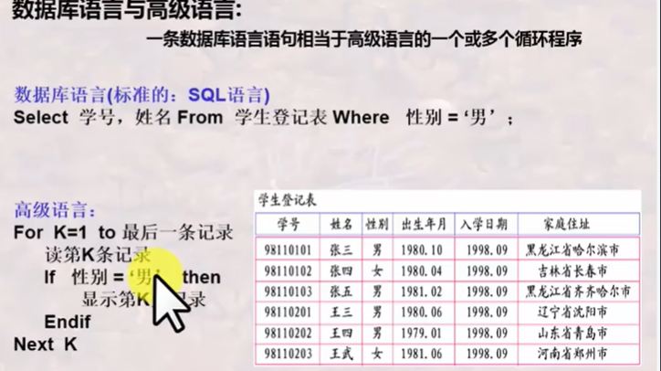

 ### 从系统实现角度看DBMS功能

语言编译器：将用数据库语言书写的内容翻译成DBMS可执行的命令，例如DDL编译器，DML编译器，DCL编译器

查询优化与查询实现：提高数据库检索速度的手段

数据存取与索引：提供数据在磁盘、磁带等上的高效存取手段

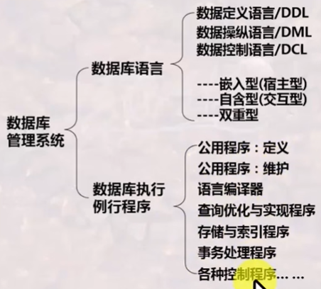

# 数据库系统的结构抽象与演变

## 数据库系统的标准结构

### 数据库系统的分层抽象

DBMS管理数据的**三个层次**

* external level = user level 用户层次
* conceptual level = logic level 概念层次
* internal level = physical level 内部层次

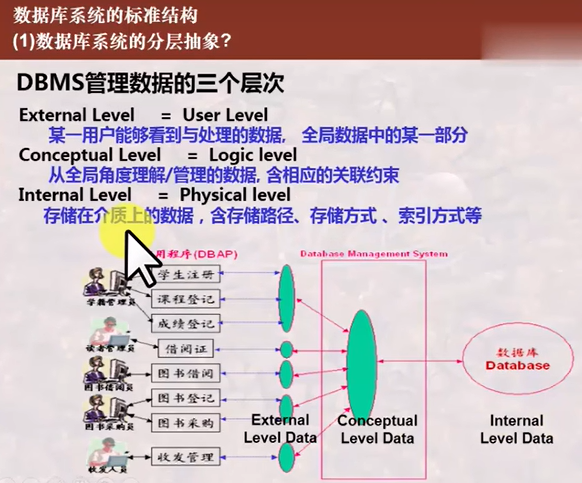

### 数据与数据的结构（模式）

模式（Schema）：结构信息

视图（View）/数据（Data）：某一种形式表现出来的数据库中的数据

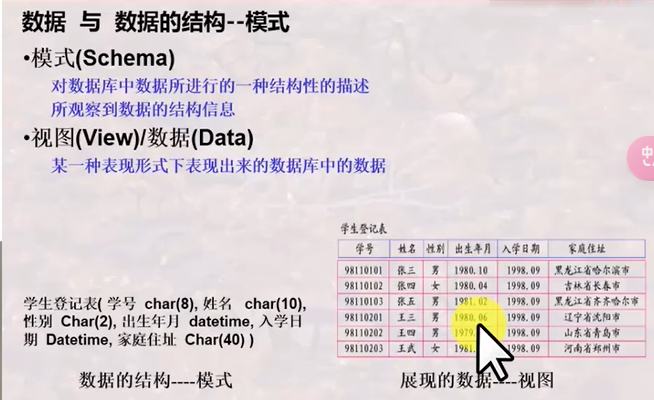

### 三级模式（视图）与两层映像

**三级视图对应三级模式**

外模式（又叫局部模式、用户模式，对应外视图）、**概念模式（又叫全局模式、逻辑模式，对应全局视图）**、内模式（又叫存储模式、物理模式，对应内视图）。如果只说模式指的是概念模式

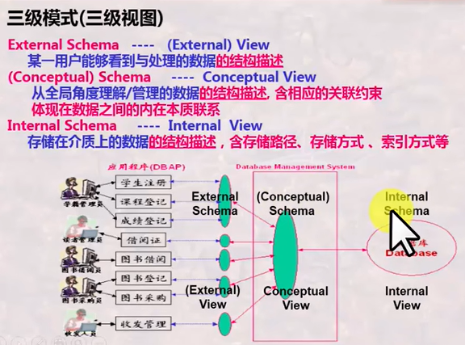

**两层映像**

E-C Mapping：External Schema-Conceptual Schema Mapping。从外模式到概念模式的映像

C-I Mapping：Conceptual Schema-Internal Schema Mapping。从概念模式到内模式的映像

### 数据库系统的标准结构

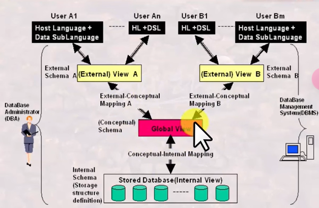

### 两个独立性

**逻辑数据独立性**：当概念模式发生变化时，可以不改变外部模式，只需改变E-C Mapping，从而无需改变应用程序

**物理数据独立性**：当内部模式发生变化时，可以不改变概念模式，只需改变C-I Mapping，从而无需改变外部模式

## 数据模型

### 数据模型 vs 模式 vs 数据

数据模型是规定统一描述方式的模型，包括：数据结构、操作和约束。**数据模型是对模式本身结构的抽象，模式是对数据本身结构形式的抽象，即数据模型是数据结构的结构。**

e.g.：关系模型。所有模式都可为抽象表（Table）的形式**[数据结构]**，而每一个**具体的模式**都是拥有不同列明具体的**表**。对这种表形式的数据有哪些**[操作]**和**[约束]**。

### 三大经典数据模型

* 关系模型：**表**的形式组织数据
* 层次模型：**树**的形式组织数据
* 网状模型：**图**的形式组织数据

### 关系模型

**关系模型的模式是表的具体结构**，关系模型的数据是具体的数据

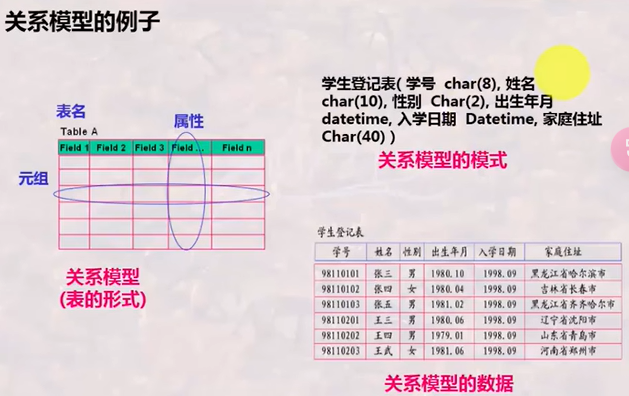

   ### 层次模型

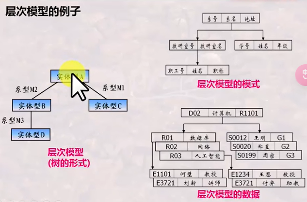

### 网状模型

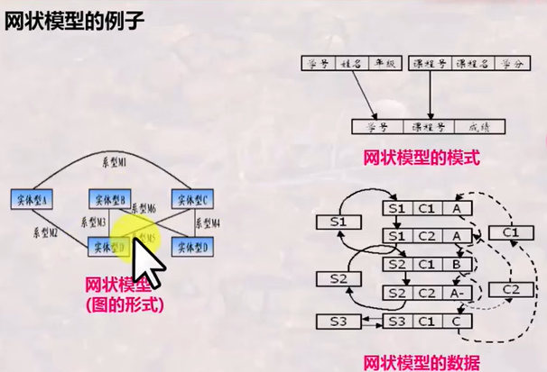

## 数据库系统的演变与发展

### 由文件系统到数据库

文件系统中，数据存取基本上以**记录**为单位

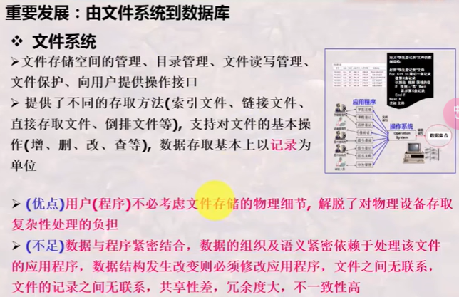

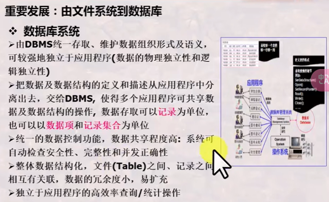

### 由层次模型数据库、网状模型数据库到关系数据库

关系数据库消除了在层次和网状模型中的指针。

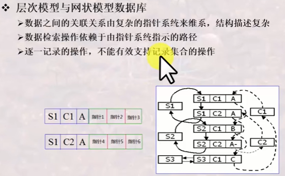

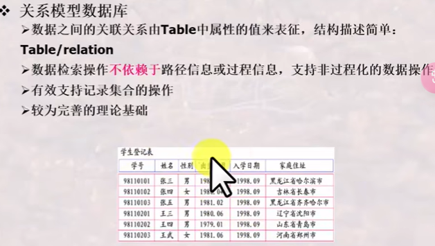

### 由关系数据库到对象关系数据库、面向对象数据库

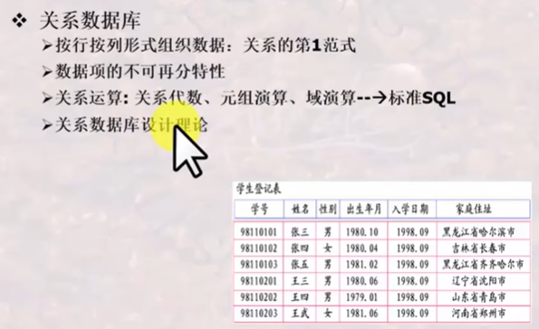

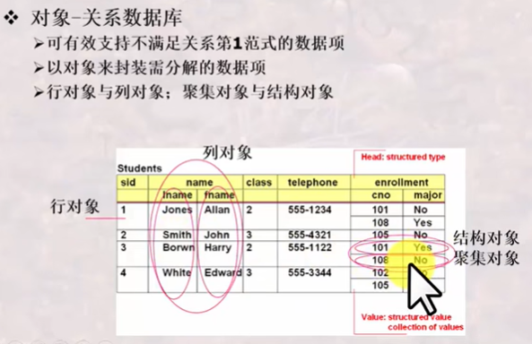

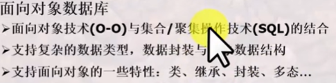

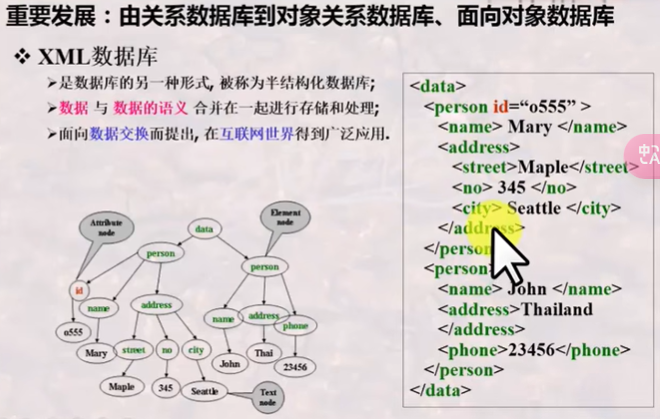

### 由多种多样的数据库到多数据库开放式互连

ODBC：Open DataBase Connection

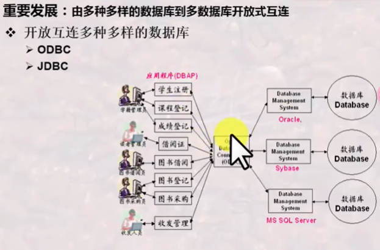

### 由普通数据库到与各种先进技术结合所形成的新型数据

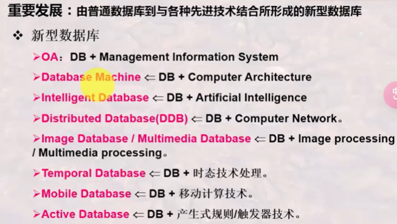

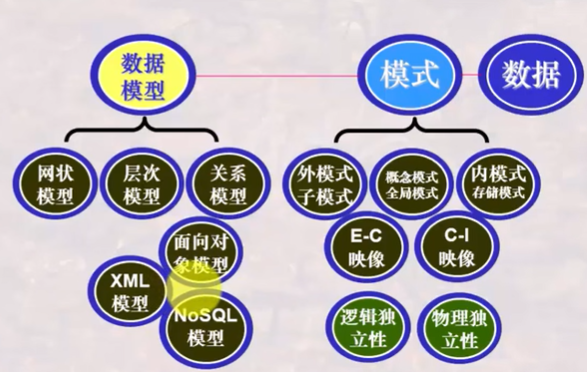