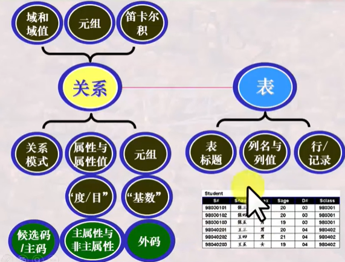
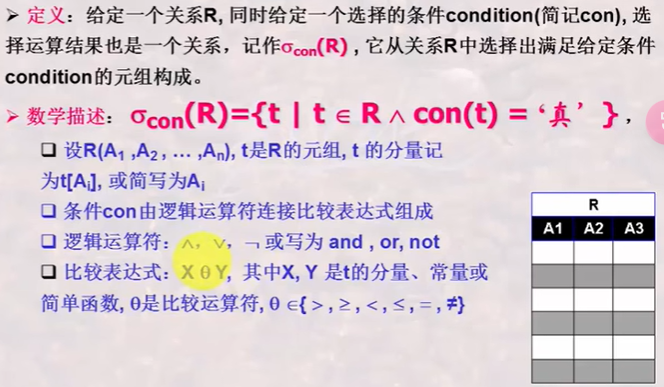
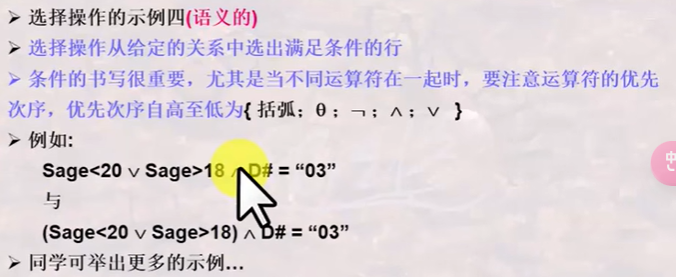
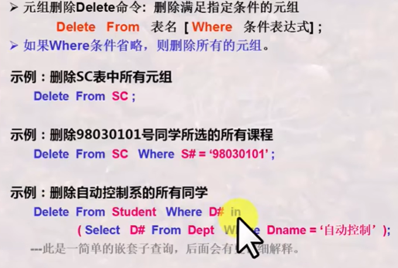
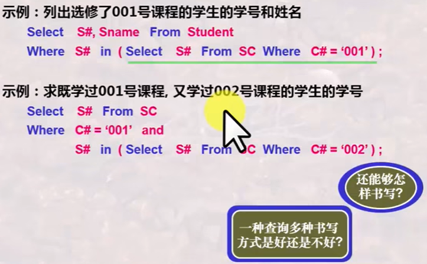
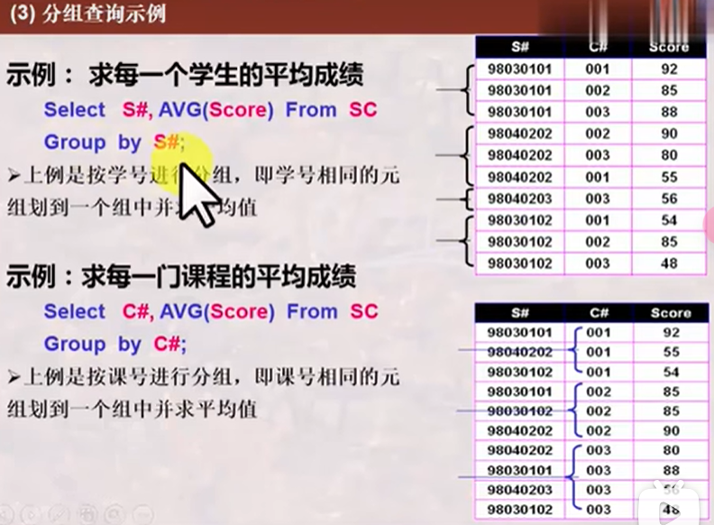
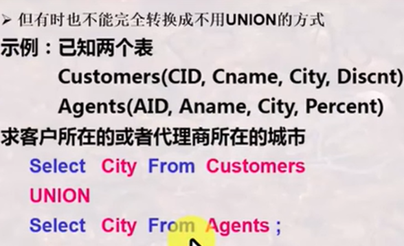
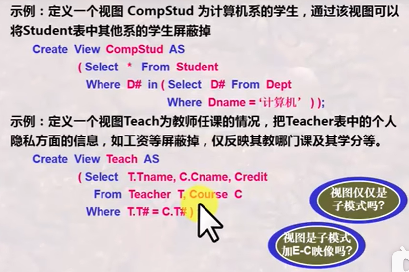
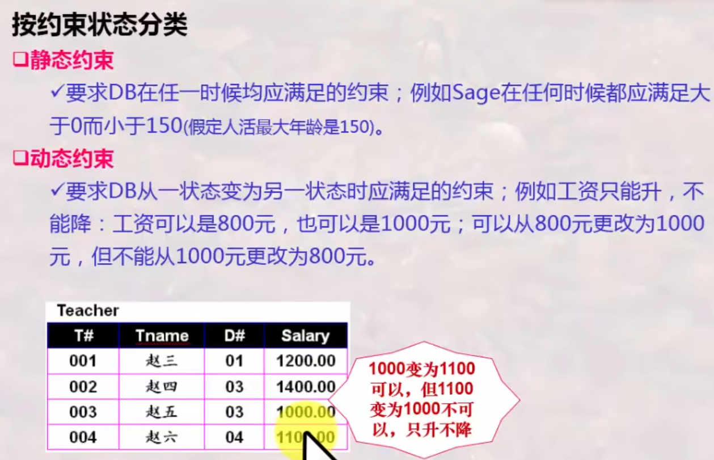
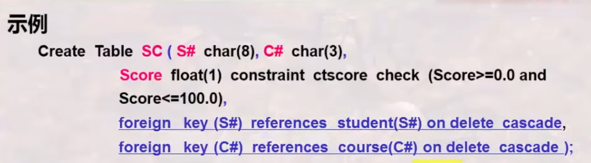

# 初步认识数据库

## 数据库

Table描述了一批相互有关联关系的数据，也叫**关系**

* 表/关系
  * （关系）模式
    * 表名
    * 表标题（格式）
  * 表内容（值）
* 列/字段/属性/数据项
* 行/元组/记录


Database：相互之间有关联关系的Table的集合

## 数据库系统

数据库系统是工作环境

* 数据库DB
* 数据库管理系统DBMS，注意和数据库系统区分，只是管理数据库的一种系统软件
* 数据库应用DBAP

* 数据库管理员DMA
* 计算机基本系统

## 数据库管理系统

### 从用户角度看数据库管理系统的功能

数据库定义：定义数据库中Table的名称、标题等

数据库操纵：向数据库的Table增删改查

**数据库控制**：控制数据库中数据的使用，哪些用户可以，哪些不可以。DBMS提供一套数据控制语言DCL给用户

数据库维护：数据库维护的实用程序一般是由数据库管理员DBA使用和掌握的

### 数据库语言

使用者通过数据库语言利用DBMS操作数据库

SQL语言：结构化的数据库语言

* 数据定义语言DDL：Data Definition Language

* 数据操纵语言DML：Data Manipulation Language

* 数据控制语言DCL：Data Control Language

数据库各种操作的执行


 ### 从系统实现角度看DBMS功能

语言编译器：将用数据库语言书写的内容翻译成DBMS可执行的命令，例如DDL编译器，DML编译器，DCL编译器

查询优化与查询实现：提高数据库检索速度的手段

数据存取与索引：提供数据在磁盘、磁带等上的高效存取手段


# 数据库系统的结构抽象与演变

## 数据库系统的标准结构

### 数据库系统的分层抽象

DBMS管理数据的**三个层次**

* external level = user level 用户层次
* conceptual level = logic level 概念层次
* internal level = physical level 内部层次


### 数据与数据的结构（模式）

模式（Schema）：结构信息

视图（View）/数据（Data）：某一种形式表现出来的数据库中的数据


### 三级模式（视图）与两层映像

**三级视图对应三级模式**

外模式（又叫局部模式、用户模式，对应外视图）、**概念模式（又叫全局模式、逻辑模式，对应全局视图）**、内模式（又叫存储模式、物理模式，对应内视图）。如果只说模式指的是概念模式


**两层映像**

E-C Mapping：External Schema-Conceptual Schema Mapping。从外模式到概念模式的映像

C-I Mapping：Conceptual Schema-Internal Schema Mapping。从概念模式到内模式的映像

### 数据库系统的标准结构


### 两个独立性

**逻辑数据独立性**：当概念模式发生变化时，可以不改变外部模式，只需改变E-C Mapping，从而无需改变应用程序

**物理数据独立性**：当内部模式发生变化时，可以不改变概念模式，只需改变C-I Mapping，从而无需改变外部模式

## 数据模型

### 数据模型 vs 模式 vs 数据

数据模型是规定统一描述方式的模型，包括：数据结构、操作和约束。**数据模型是对模式本身结构的抽象，模式是对数据本身结构形式的抽象，即数据模型是数据结构的结构。**

e.g.：关系模型。所有模式都可为抽象表（Table）的形式**[数据结构]**，而每一个**具体的模式**都是拥有不同列明具体的**表**。对这种表形式的数据有哪些**[操作]**和**[约束]**。

### 三大经典数据模型

* 关系模型：**表**的形式组织数据
* 层次模型：**树**的形式组织数据
* 网状模型：**图**的形式组织数据

### 关系模型

**关系模型的模式是表的具体结构**，关系模型的数据是具体的数据


   ### 层次模型


### 网状模型


## 数据库系统的演变与发展

### 由文件系统到数据库

文件系统中，数据存取基本上以**记录**为单位


### 由层次模型数据库、网状模型数据库到关系数据库

关系数据库消除了在层次和网状模型中的指针。


### 由关系数据库到对象关系数据库、面向对象数据库


### 由多种多样的数据库到多数据库开放式互连

ODBC：Open DataBase Connection


### 由普通数据库到与各种先进技术结合所形成的新型数据


# 关系模型

## 关系模型的基本概念

关系模型的三要素

* 基本结构 relation/table（关系/表）
* 基本操作 relation operator
* 完整性约束

关系运算：关系代数和关系演算；关系演算：元组演算和域演算

**关系运算的操作对象及结果都是集合**。

### 关系

列的取值范围叫**域（Domain）**：一组值的集合，这组值具有相同的数据类型。如男人集合、女人集合、儿童集合。

集合中元素的个数称为域的**基数(Cardinality)**

表中的一行叫**元组**（$d_1,d_2,...,d_n$），所有可能组合成的元组叫**笛卡尔积**。笛卡尔积中有多少元素称为一个**n-元组（n-tuple）**


元组中的每一个值$d_i$叫作一个**分量（component）**。

元组是从每一个域任取一个值所形成的一种组合，笛卡尔积是所有这种可能组合的集合。**笛卡尔积是由n个域所形成的所有可能的n-元组的集合**。

若$D_i$的基数为$m_i$，则笛卡尔积的**基数**，即元组个数为$m_1×m_2×...×m_n$

由于笛卡尔积中的所有元素并不是都有意义的，由此引出关系的概念。关系是一组域（$D_1,D_2,...,D_n$）的**笛卡尔积的子集**，关系是有意义的元组的集合。

由于关系的不同列可能来自同一个域，为做区分故关系的每一列叫**属性名**，域名是针对域的名字，而属性名是关系中每一列的名字，**二者不同**。


**关系模式（Schema）或表标题（head）**


**关系模式与关系**：关系模式是关系的结构，关系是关系模式在某一时刻的数据。


### 关系的特性

列是同质的：每一列中的分量来自同一个域，是同一类型的数据。

**不同的列可以来自同一个域**，其中的每一个列为一个属性，不同的属性要给予不同的属性名。


关系当中行列位置可以互换。

属性不可再分特性：**关系第一范式**。


**候选码（Candidate Key）/ 候选键**

关系中的一个属性组，其值能唯一标识一个元组，若从该属性组中去掉任何一个属性，它就不具有这一性质了。


关系中可以有很多组候选码。


**主码（Primary Key）/主键**：当有多个候选码时，可以选定一个主码。**表中的主关键字可以有多个列**。

**DBMS以主码为主要线索管理关系中的各个元组。**


**主属性与非主属性**：包含在任何一个候选码中的属性称为主属性，而其他属性被称作非主属性。


**外码（Foreign Key）/外键**：关系R中的一个属性组，它不是R的候选码，但**它与另一个关系S的候选码**相对应，称这个属性组为R的外码或外键。

外键可以为R的主属性或非主属性。


总结



### 关系模型的完整性

**实体完整性：**关系的主码中的属性值不能为空值，空值不能参与算数比较与逻辑运算。


**参照完整性：**外码必须等于一个对应表的表项值或者为空值，不能凭空捏造。


**用户自定义完整性：**用户针对具体的应用环境定义的完整性约束条件


DBMS对关系完整性的支持：**实体完整性和参照完整性由DBMS系统自动支持**


## 关系代数

关系代数运算的特点：关系代数操作以一个或多个关系为输入，结果是一个新的关系。

* 集合操作
* 纯关系操作


### 关系代数的基本操作

**并相容性**


**并**


**差**


**广义笛卡尔积**


**选择**




 注意操作顺序。



**投影**

选择是行操作，投影是列操作。


如果投影后有重复元组，则应去掉


先选择，后投影


### 关系代数的扩展操作

**交**


**θ-连接**

投影与选择只是对单个表操作，而θ则是涉及到多个表的操作


θ支持表自身连接操作，表自身连接操作要有**更名操作ρ**。


**等值连接**


**自然连接**

注意，θ连接不需要将公共属性合并，而自然连接时需要。


### 组合与应用训练

注意选择与自然连接操作下的笛卡尔积写法


注意同一个表中的与运算的写法。 


上述例子中，第一个式子不对，因为返回的是几乎所有同学，当仅学习002一门课的同学可以被这个式子筛掉。

第二个式子逻辑正确，但不满足减法的并相容性。

标准答案：


### 复杂扩展操作

**除**


除法运算一般用于“全部”、“所有”字样的题目。


**外连接**


 


## 关系演算

### 关系元组演算


#### 元组演算公式之原子公式


、

上面的例子：式子返回t，意思是只要存在一个同学u的年龄比我小，我就输出。


### 关系元组演算之存在量词与全称量词


上图中，关系代数写法：$π_{S,Sname}(Student)÷π_{S}(σ_{Score>60}(SC))$

最下面的公式范围过大，即会返回不全及格同学的名字。


上图中：对于任意一门课（u∈course），总能找到一个对应关系（s∈SC），使得学生（t）与u和s对应。


注意等于条件和属于公式放在了一起，这是由于要在这个系的所有学生和对这名同学所学的每一门课程范围内验证。

### 应用训练语义正确性与等价性变换训练


最后一个式子不正确，因为有既学过001又学过002的同学


### 关系元组演算与关系代数


上图中，关系代数的意思是：先投影出所有学生与对应课程的表（不加Course也可以），然后与李明老师讲过的课程号做除法，留下来了有重复项的单列学生名，再投影一次去重。

关系元组的意思是：对于李明老师讲过的每一门课进行验证，验证是否存在一个SC中的关系，存在就是学过，没存在就是没学过。如果对于每一门课都有对应学生与课程，则返回这个学生。


#### 元组演算公式与关系代数的等价性


### 关系域演算


看不懂思密达


### 基于关系域演算的QBE语言


 注意示例元素


上图中，下面表格的Sage的19不是指特定的19岁，而是示例元素。


同理，上面图中的表格中，张三、50、数据库都有下划线，不是真的具体的值，而是一个占位符（示例元素），表示要输出这个元素

#### QBE实现关系代数


### 关系演算的安全性


太抽象了

**关系运算有三种：关系代数、关系元组演算和关系域演算**


# 数据库语言SQL

## SQL 概述

SQL语言是集DDL、DML和DCL于一体的数据库语言

DCL语句主要用于数据定义。


**创建Database**


**创建Table**


**添加Insert**


**Select查询**


检索条件的书写


上图中上面的代码是错的


上图中下面的代码是错的

结果唯一性问题---DISTINCT保留字实现检索结果无重复元素


结果排序问题---order


模糊匹配问题---Like


### 多表联合查询


同一个表的重名处理


### 利用SQL进行增删改

**元组新增Insert**


**删除delete**




**更新Update**


### 利用SQL修正与撤销数据库


## 复杂查询与视图

### (not) in 子查询

in子查询返回一个集合





注意外层循环与内层循环。**非相关子查询**指的是内层查询独立进行。


**相关子查询**只能由外层向内存传递参数。


### some all 谓词子查询


上图中第三个答案是相关子查询

**等价变换**


 ### (NOT) EXIST 子查询


not exist: 


### 利用SQL语言进行结果计算与聚集计算


### 利用SQL语言进行分组查询与分组过滤

Group by



聚集函数是不允许用于Where字句的。

分组过滤：Having 


**HAVING字句与WHERE字句表达条件的区别**


上图中，Where后边跟的是查询有两门以上不及格课程的同学。最后的Group by是 Avg(Score)用的

### 用SQL实现关系代数操作

并 UNION，交 NTERSECT，差 EXCEPT





空值null的处理


除了**is (not) null** 之外，空值不满足任何查找条件。

如果null参与聚集运算，则除**count(*)**之外其它聚集函数都忽略null。


**内连接与外连接**


### SQL 视图





上图中，注意视图定义中带有聚集函数则视图不可随着表的变化而自动更新。


视图中包含了单个基本表的主键是视图可以更新的必要条件。


这道题选A。要是返回10个不及格同学的记录应该这么写：

```sql
SELECT * FROM student
WHERE S# IN (
    SELECT S# FROM SC WHERE score < 60
);
```

## SQL 语言与数据库完整性和安全性

### 数据库完整性

分为广义完整性和狭义完整性（专指**语义完整性**）。

关系模型中有完整性要求：实体完整性、参照完整性、**用户自定义完整性（语义完整性）**

完整性约束条件的一般形式：

**Integrity Constraint ::= (O, P, A, R)**


按约束对象分类：


按约束来源分类


按约束状态分类




#### 列约束


这个例子中，ctssex是检查的名字，下面检查的Sage的约束条件就没有名字。references是外键，on delete cascade 是 级联删除，当被引用表的D#对应行被删除，这个表中所有相同D#行被删除


#### 表约束


注意涉及到两列的时候要用表约束（放在列约束最后边）。



级联删除的表约束放在最后边


#### ASSERTION 断言


### 利用SQL实现数据库的动态完整性

**Trigger 触发器**


这张图中，x是新数据，y是旧数据


这张图中，newi是新加行，where后面是找出对应的学生行


### 数据库的安全性


DBMS的安全机制


#### 数据库自主安全性机制


数据库自主安全性访问规则


SQL语言的用户与权利


**授权命令**：grant 权限 on 表 to 某人


**收回授权**：


Create Table 没有定义安全性约束的功能
