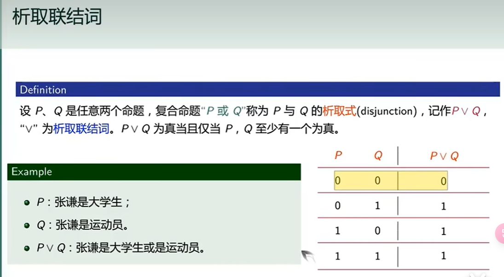

# 命题

## 什么是命题

  ## 命题连接词

 

## 命题公式与真值表

## 命题公式分类与等价

 

## 命题等价公式及应用

## 范式

## 主范式

## 命题蕴含公式

 

 

  

## 演绎法推理

  

 

# 谓词

## 谓词引入

****

## 量词引入

## 谓词符号化

## 谓词公式

 

## 自由变元与约束变元

## 公式的解释和分类

## 公式等价

## 前束范式

  

## 谓词演算推理

## 谓词综合推理

 
