# 第一章 集合及其运算

## 1.1 集合的概念

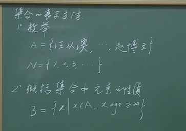

## 1.2 子集 集合的概念

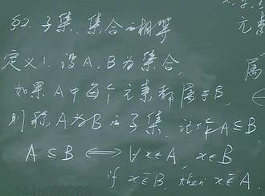

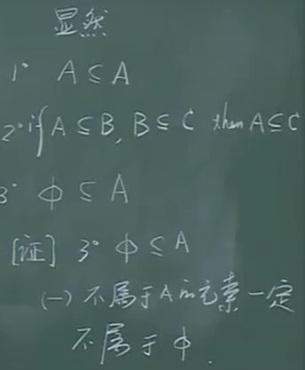

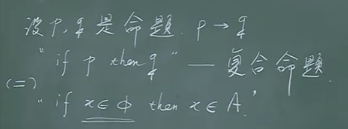

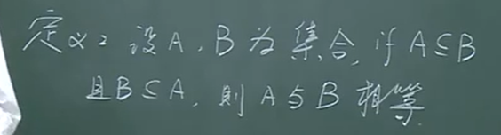

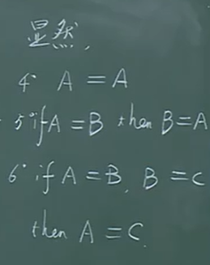

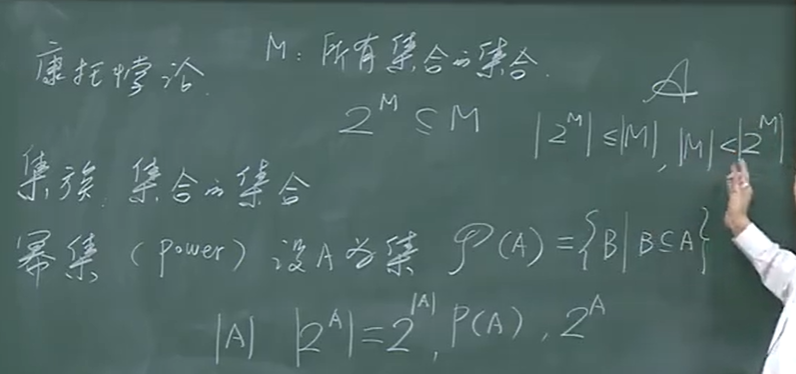

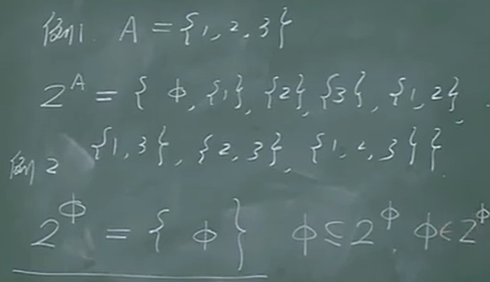

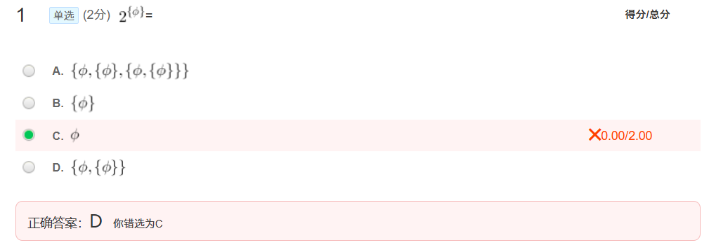

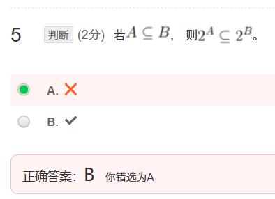

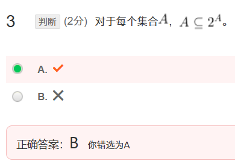

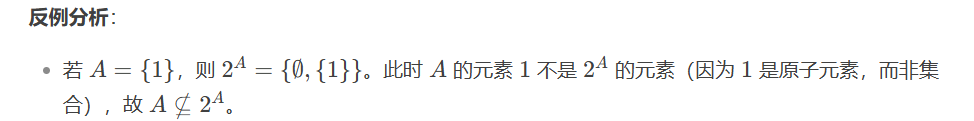

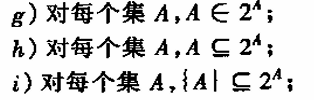

## 1.3 集合的运算

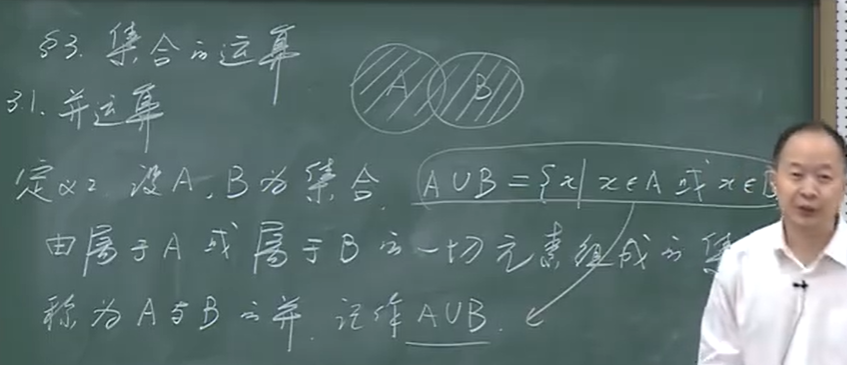

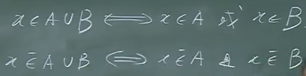

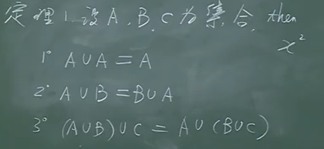

  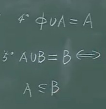

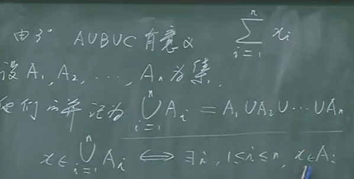

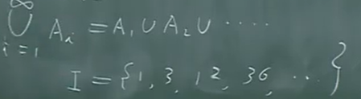

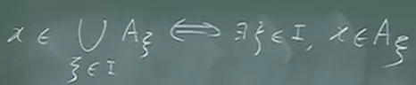

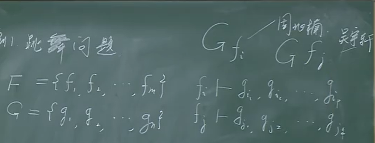

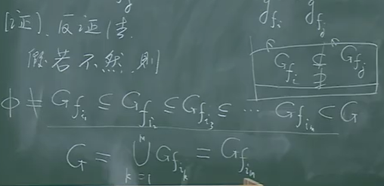

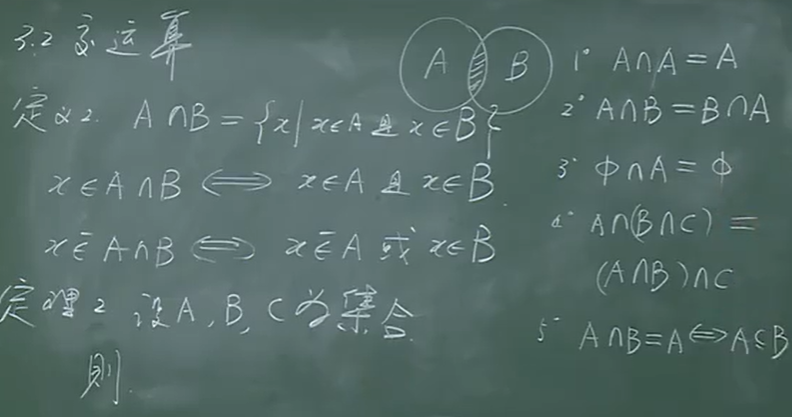

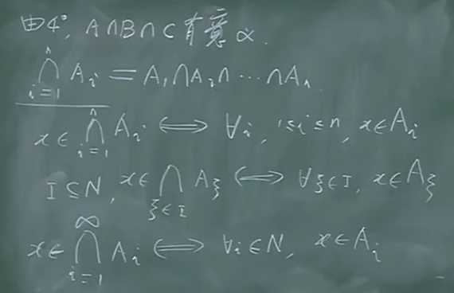

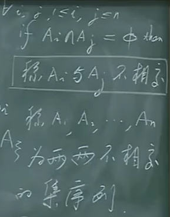

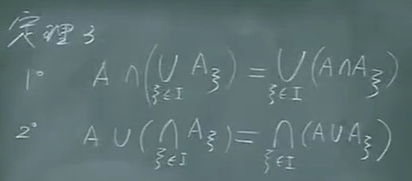

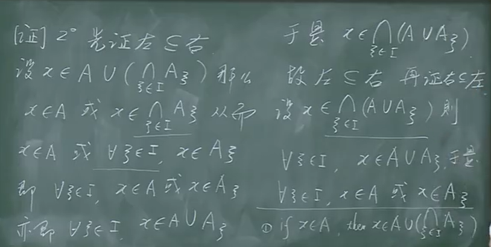

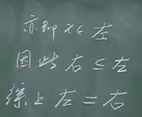

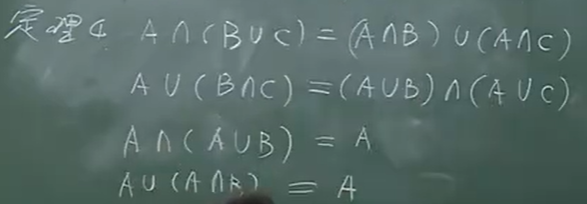

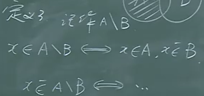

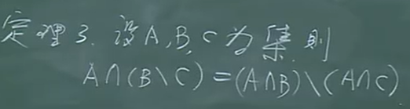

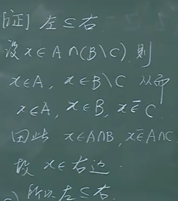

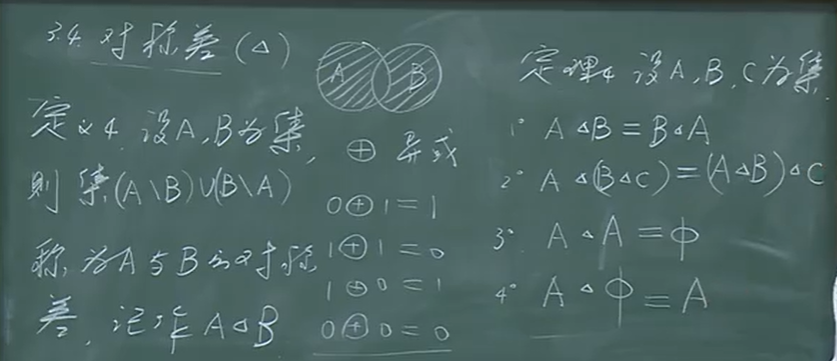

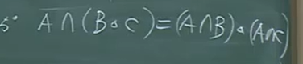

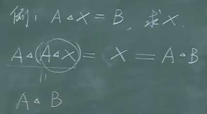

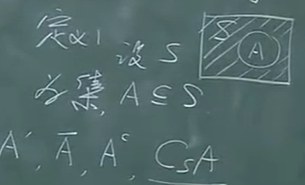

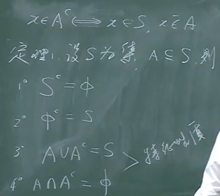

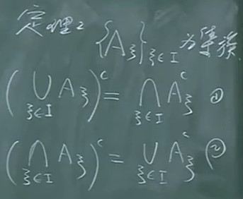

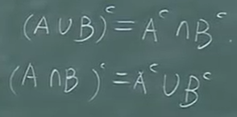

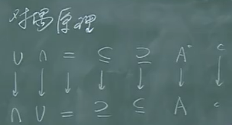

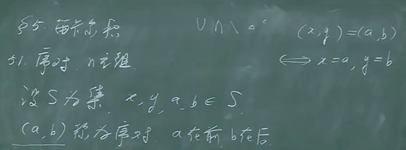

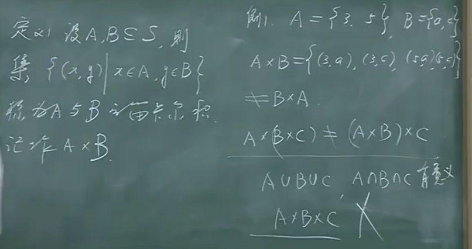

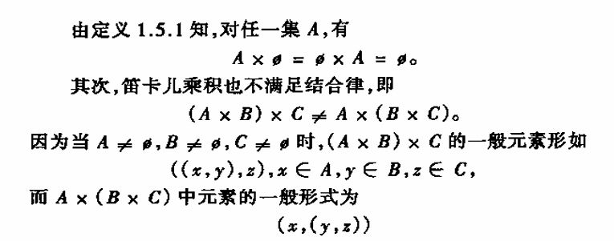

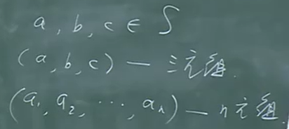

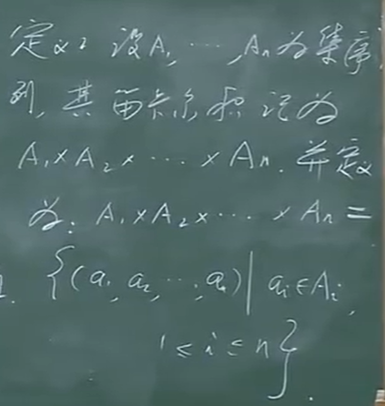

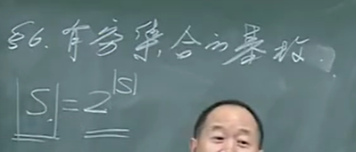

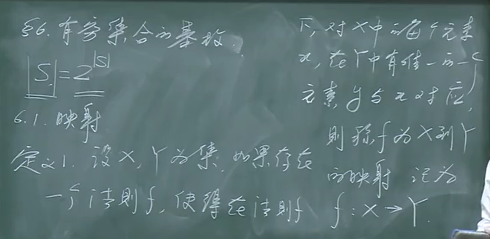

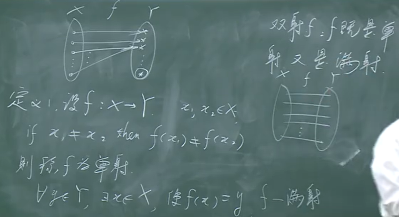

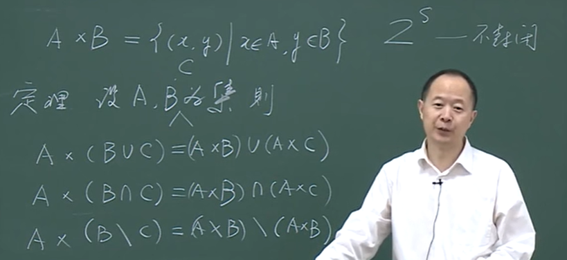

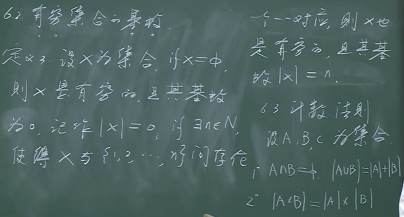

# 第二章 映射

 ## 2.1 映射

 

f:对X中**每个**元素x**都有**Y中唯一确定的元素y与之对应。

单射：每一个y仅对应一个x

满射：所有y都有x对应

## 2.2 鸽舍原理（抽屉原理）

   

## 2.3 映射的一般性质

## 2.4 映射的合成

## 2.5 逆映射

 

## 2.6 置换

 

## 2.7 运算

## 2.8 特征函数

# 第三章 关系

## 3.1 二元关系

## 3.2 几种特殊的关系

## 3.3 关系的运算

## 3.4 关系的传递闭包

 

## 3.5 关系矩阵与关系图

 

## 3.6 等价关系

 

 

 

## 3.7 偏序关系

 

## 4.2 连续统集

 

 

## 4.3 无穷集合的基数

·

  

 

## 4.5 悖论

 

#  第六章 图的基本概念

## 6.2 图的基本概念

## 5.3 路 图 连通

## 5.4 补图 双图

 

## 5.5 欧拉图

## 5.6 哈密顿图

 

## 5.7 图的表示

 

## 5.8 带权图

# 第六章 树 割集

## 6.1 树

## 6.2 生成树

 

## 6.3 割点 桥

# 第八章 连通度 匹配

## 8.1 连通度

## 8.2 门格尔定理

·

## 8.3 匹配问题

# 第九章 平面图 顶点着色

## 9.1 平面图及欧拉公式

## 9.2 非平面哈密顿图

## 9.3 平面图的判定

## 9.4 图的着色

 

# 第十章 有向图

## 10.1 基本概念

## 10.2 有向路 有向圈

## 10.4 邻接矩阵

 ## 10.5 有根树 有序树

 ## 10.6 比赛图

