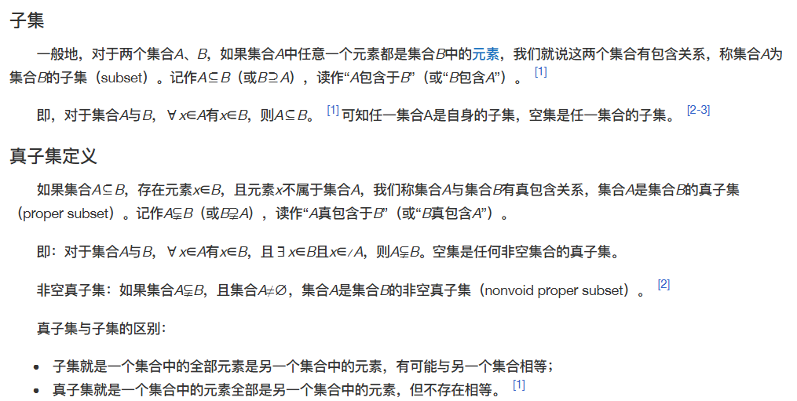
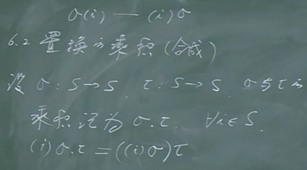
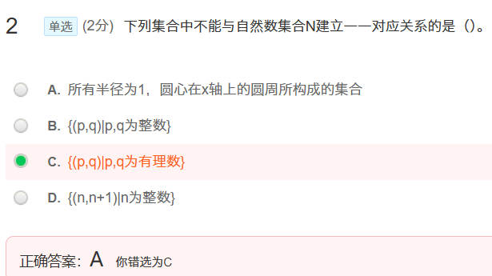

# 第一章 集合及其运算

## 1.1 集合的概念

## 1.2 子集 集合的概念

## 1.3 集合的运算

  

# 第二章 映射

 ## 2.1 映射

 

## 2.2 鸽舍原理（抽屉原理）

   

## 2.3 映射的一般性质

## 2.4 映射的合成

## 2.5 逆映射

 

## 2.6 置换

 

## 2.7 运算

## 2.8 特征函数

# 第三章 关系

## 3.1 二元关系

## 3.2 几种特殊的关系

## 3.3 关系的运算

## 3.4 关系的传递闭包

 

## 3.5 关系矩阵与关系图

 

## 3.6 等价关系

 

 

 

## 3.7 偏序关系

 

## 4.2 连续统集

 

 

## 4.3 无穷集合的基数

·

  

 

## 4.5 悖论

 

#  第六章 图的基本概念

## 6.2 图的基本概念

## 5.3 路 图 连通

## 5.4 补图 双图

 

## 5.5 欧拉图

## 5.6 哈密顿图

 

## 5.7 图的表示

 

## 5.8 带权图

