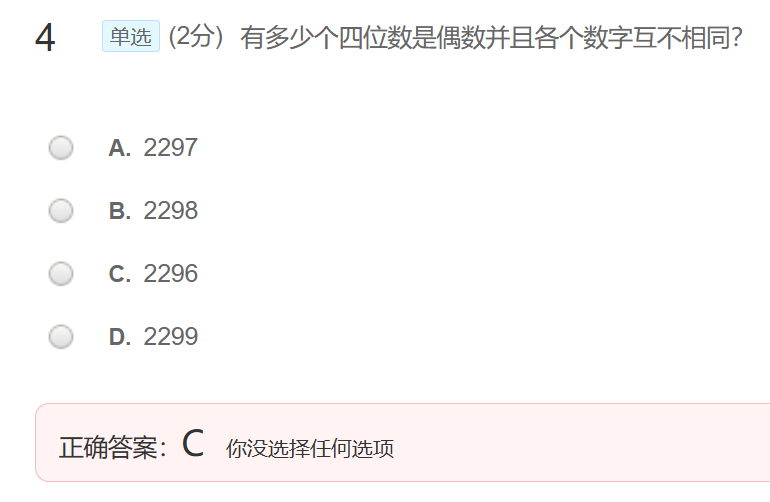
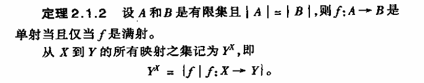
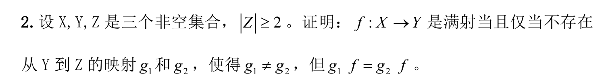
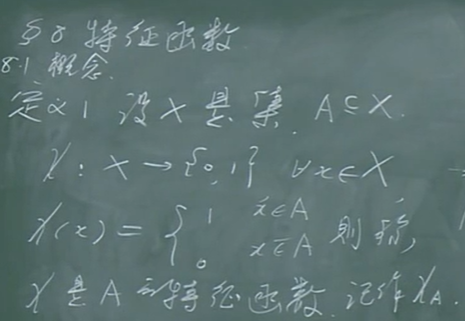
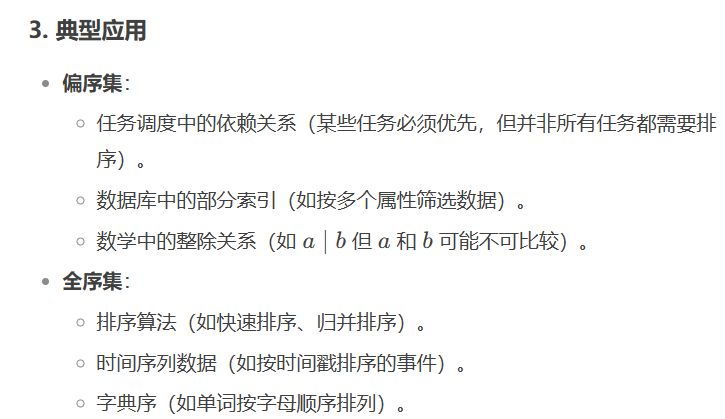
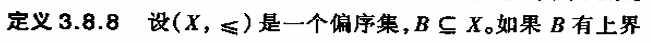
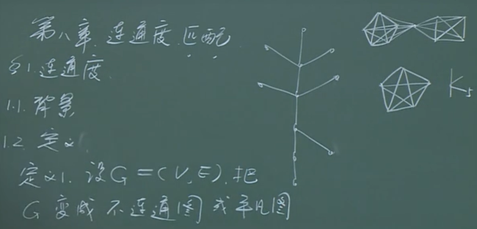
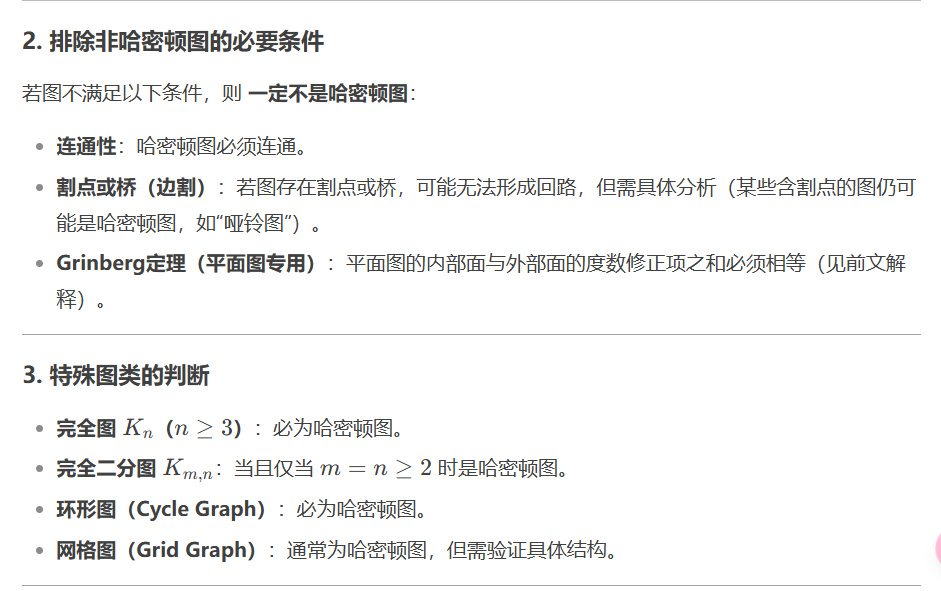

# 第一章 集合及其运算

## 1.1 集合的概念

## 1.2 子集 集合的概念

## 1.3 集合的运算

  

# 第二章 映射

 ## 2.1 映射

 

f:对X中**每个**元素x**都有**Y中唯一确定的元素y与之对应。

单射：每一个y最多对应一个x

满射：所有y都有x对应

## 2.2 鸽舍原理（抽屉原理）

   

## 2.3 映射的一般性质

## 2.4 映射的合成

 

## 2.5 逆映射

 

## 2.6 置换

 

## 2.7 运算

## 2.8 特征函数

# 第三章 关系

## 3.1 二元关系

## 3.2 几种特殊的关系

自反必然包含所有(x,x)。反自反是所有的(x,x)均不存在。

## 3.3 关系的运算

## 3.4 关系的传递闭包

 

 

## 3.5 关系矩阵与关系图

 

## 3.6 等价关系

 

 

 

a. $2^{n^2 - n}$ b.$2^{n^2 - n}$c.$2^{n(n-1)/2 + n}$

## 3.7 偏序关系

 

# 第四章 无穷集合及其基数

# 4.1 可数集

**可数集是无穷集合**

可数个有穷集的并集可以是可数的，也可以是有穷的。

## 4.2 连续统集

[0,1]中有理数构成的集合是可数集。

 

 

## 4.3 无穷集合的基数

补充概念：**集合的对等**

**集合的对等**指两个集合之间存在**双射函数**（即一一对应），使得它们的元素可以完全配对，没有剩余。这种关系表明它们的**基数**（元素个数，包括无限情况下的“大小”）相同。具体要点如下：

---

### 核心定义
- **对等**：若集合 \( A \) 和 \( B \) 之间存在一个双射函数 \( f: A $\to$ B \)，即：
  - **单射**：\( A \) 中不同元素映射到 \( B \) 中不同元素；
  - **满射**：\( B \) 中每个元素都被 \( A \) 的某个元素映射到；
- 则称 \( A \) 与 \( B \) **对等**，记为 \( A $\sim￥ B \)，且它们的基数相同，即 \( |A| = |B| \)。

---

### 关键例子
1. **有限集**：
   - \( A = \{1, 2, 3\} \) 与 \( B = \{a, b, c\} \) 对等，基数均为 3。
2. **无限可数集**：
   - 自然数集 \( $\mathbb{N}$ \) 与偶数集 \( \{2, 4, 6, $\ldots$\} \) 对等，基数均为 \( $\aleph_0$ \)（阿列夫零）。
3. **不可数集**：
   - 区间 \([0,1]\) 与实数集 \( $\mathbb{R} $\) 对等，基数均为连续统 \($ \mathfrak{c}$ \)。

---

### 对等的性质
- **等价关系**：
  - **自反性**：\( A $\sim$ A \)；
  - **对称性**：若 \( A $\sim$ B \)，则 \( B $\sim$ A \)；
  - **传递性**：若 \( A$ \sim$ B \) 且 \( B$ \sim $C \)，则 \( A $\sim $C \)。

---

### 对等与基数的关系
- **基数符号**：所有对等的集合共享同一个基数符号。例如：
  - 所有基数为 3 的集合标记为 \( |A| = 3 \)；
  - 所有可数无限集标记为 \( $\aleph_0 $\)；
  - 所有连续统基数集标记为 \($\mathfrak{c}$ \)。

---

### 为什么对等强调双射？
- **双射的严格性**：双射确保两个集合的“大小”完全一致，既无重复也无遗漏。
- **对角线法证明**：若两集合不对等（如自然数集与实数集），则无法构造双射，基数不同（例如康托尔对角线法证明实数不可数）。

---

**总结**：集合的对等是基数相同的严格数学定义，核心是存在双射函数。无论集合元素的具体内容如何，只要元素能一一对应，它们就对等。

·

  

 

 

#  第六章 图的基本概念

## 6.2 图的基本概念

同构图是一对无向图。

下面的例子的每个点度均为3，故互为同构。

## 5.3 路 图 连通

## 5.4 补图 双图

 

## 5.5 欧拉图

## 5.6 哈密顿图

 

这道题就是p-1个顶点相互有路，然后多出一条边连接第p个结点

必要条件，剩下的支的个数为3，但减去的顶点数为2.

## 5.7 图的表示

 

## 5.8 带权图

## 5.9 整理

### 联通图

充分1：对于任意的u,v，当uv∉E时，degu+degv >= p - 1

充分2：对于任意的u，当u∈E时，degu >=$\lceil \frac{p}{2} \rceil$

有圈充分：对于任意的u，当u∈E时，degu 为偶数且不为0。2

偶图充要：所有的圈均为偶数长。

图兰定理：若图中不存在三角形，则图中的边数最多为$\lceil \frac{p^2}{4} \rceil$

### 欧拉图

充要：连通图中顶点度均为偶数

欧拉开迹：连通图中恰有两个度为奇数的顶点

开迹计算：连通图中恰有2n个度为奇数的顶点，则全部可以排成n条开迹，并至少有n条开迹

### 哈密顿图

必要：w(G - S) <= |S|

充分1：顶点大于3的连通图中，任意u∈E，有degu＞=p/2

充分2： 对于任意的u,v，当uv∈E时，有degu + degv >= p

哈密顿路充分：同连通图充分1。

# 第六章 树 割集

## 6.1 树

## 6.2 生成树

## 6.3 割点 桥

不一定是，例如“8”图

一定不是，必要条件

一定不是，因为边不能经过两次

一定不是，因为边不能经过两次

# 第八章 连通度 匹配

## 8.1 连通度

n-顶点联通简称n-联通

## 8.2 门格尔定理

·

## 8.3 匹配问题

# 第九章 平面图 顶点着色

## 9.1 平面图及欧拉公式

## 9.2 非平面哈密顿图

## 9.3 平面图的判定

## 9.4 图的着色

 

# 第十章 有向图

## 10.1 基本概念

## 10.2 有向路 有向圈

## 10.4 邻接矩阵

 ## 10.5 有根树 有序树

 ## 10.6 比赛图

